```{r global_options, include=FALSE}
knitr::opts_chunk$set(fig.retina=3,
                      echo= TRUE,
                      eval = TRUE,
                      eval = TRUE,
                      message = FALSE,
                      warning = FALSE,
                      cache = TRUE)
set.seed(2016L)
#set global retina = resolution

```

```{r, echo=FALSE, out.width="50%", fig.cap="Data Re-presented.",layout="m-page", fig.width=8, fig.height=4}

```


# Overview of Problem Statement: Difficult to sense-make news headlines in digital landscape 

Making sense of the news in today’s landscape is extremely difficult because of: 

1)	The volume of information available to you via digital channels;
2)	Social media bubbles may create echo chambers that only serve you only one aspect of news making it difficult to understand the full context;
3)	News can be manipulated based on phishing (creating duplicates) and inflated engagement metrics campaigns.

This can be useful as news headlines can have very real impact on not just personal sense-making but also cause tangible effects. This can be seen from how media reporting can contribute to the public’s understanding of safe distancing measures during COVID-19 to how it can influence share prices on the stock market. The following blogpost is to establish the project’s objectives, explore current practices, and prototype methods in order to help readers navigate the digital news landscape.

# Project Objective: Provide readers with useful snapshots of news headlines

As such, the team’s goal is to build an accessible dashboard that can help readers of local news sites (both mainstream and non-mainstream) quickly navigate and understand a large corpus of news. This will be done by applying statistical methods to sort large volumes of unstructured data. The intended result is different snapshots that would allow readers to:

1)	**[Explore]** Sort through and identify key events in the large corpus of news events by:
    a.	Time period;
    b.	Topic and; 
    c.	Keyword 
2)	**[Discover]** Understand in greater detail the context around each theme and news source by
    a.	Sentiment and; 
    b.	Word structure
3)	**[Detect]** Be alerted to unusual patterns 
    a.	Identify anomalous events and articles based on engagement.

As such, while the presentation of the ‘snapshot’ may appear simple, the methods that would derive these insights are not. The approach taken for this project is based on a mixed of deep research of current statistical methods, domain knowledge of the local news reporting landscape and rigorous data wrangling.


# Our Data Source: Local News Reports in 2020 

The data selected for analysis is from 1 January 2020 to 31 December 2020. These local news sites are a mix of mainstream (Straits Times, Channel News Asia, AsiaOne) and non-mainstream (Mothership, MustShareNews, The Independent) sites. A few others such as (TODAY Online, The Online Citizen) were initially selected but removed from our observations. This will be explained at the data wrangling phase.

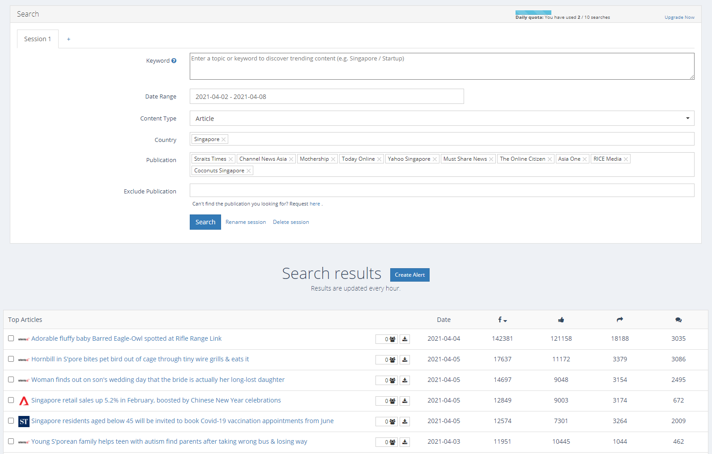

Data extracted from [Prrt](prrt.co) is extremely useful for the project as it provides an easy tool for the extraction of the article headline, corresponding URL and Facebook Engagement metrics (Likes, Shares and Comments). In the absence of actual webviewership data, Facebook engagement data is often used as a proxy as the dataset is more easily [accessible](https://www.facebook.com/journalismproject/news5-facebook-tools-major-news-event-reporting). Facebook is also arguably the most widely used social media platform in Singapore> it is also still used by major news sites for information dissemination as well as resource for analysis and understanding of the virality of a news article and [topic](https://help.crowdtangle.com/en/articles/4554891-how-nbc-news-uses-crowdtangle-to-source-and-tell-local-stories-on-a-national-level).

# Literature review: 

## Importance of analyzing unstructured news data 
While preparing for the project, we researched four different areas to understand the key areas that needed to be addressed. The main challenge of the project is that of dealing with large volumes of unstructured data (224,351 news headlines and 2,692,224 observations). There are also limited libraries we can call upon in R as text analytics packages for R on CRAN are limited in number. Visualization packages that avoid simple word cloud comparisons are far fewer in number.  This is compounded by the fact that the project is very niche as it is set in the local context, and as such, would have little case study options readily available.  

Despite these constraints, the team is of the opinion that the project is a worthy one as there is an increasing need to help navigate the digital news landscape. As mentioned in the earlier section, news can have a very large and tangible impact on our lives and the increasing availability of data visualization tools within the realms of journalism can help readers make sense of the stories that are out there. However, as identified by Data Journalism, there is not enough being done to take advantage of [this](https://datajournalism.com/read/handbook/two/experiencing-data/data-visualisations-newsroom-trends-and-everyday-engagements). 

Fortunately, as news media tended to follow standardized schools of reporting (e.g. [AP style Book](https://www.apstylebook.com/)), there was research available (predominantly) on different methods used to analyse western media. These methods could then be adopted for analysing Singaporean media. For instance, text cleaning and sentiment analysis could easily adopt the English packages as they were unlikely to contain colloquial lingua franca that was most used on local social networking sites. Furthermore, the use of standardised stylebooks for news reporting would help the Latent Dirichlet Model which the team intends to use, as the model relies on the probabilities of similar words across similar topic distributions. 


## Impact of News Media on our lives 

As identified by [Bhargava, Bishop and Zuckerman](https://cpb-us-w2.wpmucdn.com/sites.northeastern.edu/dist/d/53/files/2020/02/CJ_2020_paper_39.pdf), there is clear evidence of the influence of the news media and its news reporting. They posit that building tools can help readers quickly analyse content, influence and the spread of news. In turn, they will be better equipped to respond to the growing impact of visual (and viral) news. This group’s earlier study also demonstrated that mobile app usage frequency can be correlated to news events and reporting (Chee, Nam, Foo 2020).  

Kouivunen Niemi and Masoodian echo this in their recent article, visualising narrative patterns in [online news media](https://link-springer-com.libproxy.smu.edu.sg/content/pdf/10.1007/s11042-019-08186-9.pdf). They argue that the new media and its reports can have “widespread repercussions in the public perception of past and present phenomena” and proposed “temporal visualizations for examining differences in media narrative patterns over time and across publications”. This is provide a tool or method to simply to report findings in an “easy to understand but effective way”. They also go further to lament how these type of (text) studies are “almost invariably presented in tables, or using simple graphs such as bar charts or line charts”. 


## Impact of Social Media and Echo Chambers 

In recent years, increasing amounts of research (the echo chamber effect on [social media](https://www.pnas.org/content/118/9/e2023301118) have also point to the dangers of social media companies inadvertently creating [echo-chambers](https://edu.gcfglobal.org/en/digital-media-literacy/what-is-an-echo-chamber/1/)in order to maximise engagement metrics. They do this by presenting readers content that they are likely already biased towards, thus increasing the propensity (Platforms like Facebook are designed to profit for human’s [confirmation bias](https://www.wired.com/story/facebook-twitter-echo-chamber-confirmation-bias/) that they continue engagement with the [social media platform](https://www.theguardian.com/science/blog/2017/dec/04/echo-chambers-are-dangerous-we-must-try-to-break-free-of-our-online-bubbles ).

To combat this, researchers propose that readers pay attention the news source to ensure authenticity and the corresponding engagement metrics in order to determine if an article has been manipulated to reach a wider audience (e.g. when the engagement ratios for a content does not appear to be [natural](https://www.latimes.com/business/technology/story/2019-12-06/social-media-manipulation-nato-research). This happens typically when ‘likes’ or ‘shares’ are mobilised. 
As such, we intend to provide a range of 6 sources that readers can easily access when they are looking for information related to a topic. They are then able to explore the context surrounding a topic (i.e. sentiment and co-occurring words) and use engagement metrics to identify if there are anomalous articles. 


## Limited resources for visualising unstructured data

A commonly used method for visualising text is the use of [word clouds](https://towardsdatascience.com/headlines-articles-analysis-and-nlp-4013a66dbac) . They often aim to represent the most commonly used words in a corpus by size but have limited utility at best (crf. when word clouds are [not enough](https://www.keatext.ai/en/blog/artificial-intelligence/3-strengths-and-3-weaknesses-of-word-clouds/), and mis-representative of the data at [worst]https://towardsdatascience.com/word-clouds-are-lame-263d9cbc49b7). Often, they include common verbs that do very little to explain word in the context of the corpus of data (crf. [Why word clouds harm insights](https://getthematic.com/insights/word-clouds-harm-insights/#:~:text=Word%20clouds%20lack%20context.,or%20even%20the%20entire%20comment).

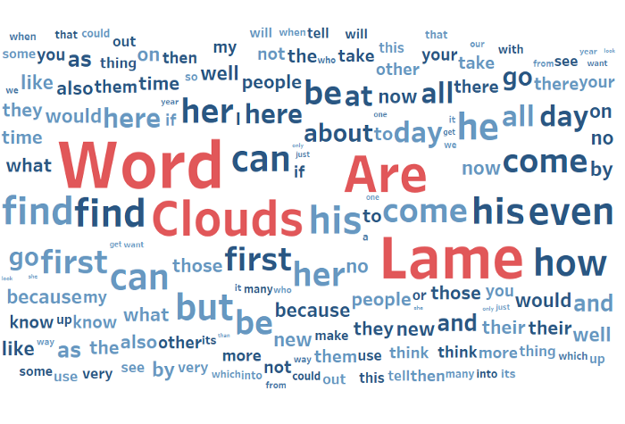

Other interesting methods explored for text visualization build on Venn and Euler diagrams. 

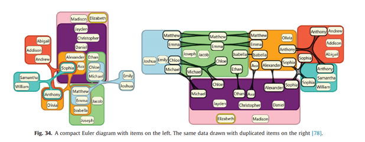

They include work by Rodgers, Stapleton & Chapman ([Visualizing sets with linear diagrams](https://kar.kent.ac.uk/50020/) which demonstrate the intersection where words are shared by different sources or topics.


A similar approach was adopted by Luz and Masood (a comparison of linear and mosaic diagrams for [set visualization](https://journals.sagepub.com/doi/abs/10.1177/1473871618754343).


However, these methods were not entirely applicable for our project as these visualizations benefitted from a small number of documents that could be extensive in length. Our dataset however, consists of over 200,000 documents that were all very short in length (a news headline typically has up to 30 words). 

Other than visualising topics and their word occurrences in other texts, we also intended to learn methods to visualise the temporal evolution of news topics as we intended to allow readers to explore how news evolved across a full year in 2020. This, we felt, would be interesting as the COVID-19 pandemic allowed for us to track the evolution of a news topic across nearly 12 months. This was somewhat of an irregularity in news media as the typical news cycle operates on a much shorter cycle of 48 hours (or less). 
While researching on this, we came across interesting methods used by Sheidin & Lanir ([Visualising Spatial-Temporal Evaluation of News Stories](https://dl.acm.org/doi/10.1145/3030024.3040984).

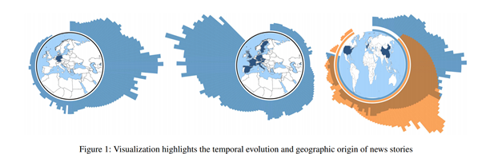

The visualisation presents an idea for a system that is able to analysis the spread and volume of news episodes across space and time. However, this is not entirely applicable to the dataset used in our project because the number of news sources in the study are low (6) and all based in Singapore. Another mitigating, but more minor factor, is the lack of time data in the dataset. 

# Approach

Based on the research, our proposed approach for the project would be to create three separate modules that would allow users to 1) explore the corpus to identify key events 2) understand the key events / topics in greater detail and 3) to be alerted to unusual patterns. While the eventual presentation will appear to be a simple (and ideally effective) report card of the media situation, it will be grounded at the backend by statistical methods and rigorous data wrangling. 

## 1. Data extraction and Wrangling 

### Data Extraction 
As mentioned above, the dataset that we have extracted is taken from [Prrt](prrt.co). This is because Prrt is unique to local news media publishers in Singapore (and Malaysia) and allows us to extract news headlines together with its corresponding social media engagement. 
For other types of news extraction, there are R packages that offer news headline extraction. These include [Guardian API]( https://cran.r-project.org/web/packages/guardianapi/index.html) [Media News](https://cran.r-project.org/web/packages/MediaNews/index.html) and [Newsmap](https://github.com/koheiw/newsmap). 

An interesting package for news extraction and analysis is [NewsFlow](https://github.com/koheiw/newsmap) as it allows for tracking of the flows between offline and online news. It is an interesting case study of how quickly news spreads from the offline sphere to the online one, or vice versa. 

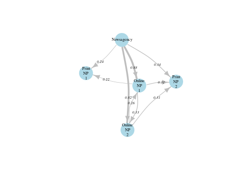

However, as the scope of the project is primarily concerned with online news, we will not be able to utilize the NewsFlow package for our analysis. 


### Data Exploration Before Cleaning

Before we started on data cleaning, we want to explore the dataset to identify if there are any potential issues (such as low or missing values) in the dataset. R provides many packages that can help do this (e.g. [Dplyr](https://dplyr.tidyverse.org/reference/summarise.html), [GGbetweenstats](https://indrajeetpatil.github.io/ggstatsplot/articles/web_only/ggbetweenstats.html), [Data Explorer](https://cran.r-project.org/web/packages/DataExplorer/vignettes/dataexplorer-intro.html) and [Janitor](https://cran.r-project.org/web/packages/janitor/index.html).

We will use Data Explorer to perform preliminary data exploration, to identify which areas to go into further depth. Data explorer allows for very quick EDA and feature reporting. For this step, we will need to install Tidyverse and DataExplorer.

```{r}`r ''`
install.packages(“DataExplorer”, “tidyverse”, dependencies = TRUE)
library(DataExplorer, tidyverse)
#read csv file using tidyverse from your local source folder
media_explore <- read_csv(“Data/all_media.csv”) 
#check data for missing values
data(media_explore) 
plot_missing(media_explore) 
#create a pdf report 
create_report(media_explore) 
```


Results from the Data Explorer also show little issues with missing values as the dataset is relatively complete and that the data fields are in the correct data types (e.g. chr and num) 


### Scoping the dataset 

While we wanted a good mix of news sites in our dataset for analysis, we had to be judicious in pruning four sites from our dataset. These were Rice Media, The Online Citizen, TODAY Online  and Yahoo SG. These sites were removed for the following reasons:
  -	Rice Media did not publish every day and contributed to a very small amount of articles published in 2020;
  -	The Online Citizen had long a periods of missing data from the months of April 2020 to August 2020; 
  -	TODAY Online tended to be similar in style and scope as Channel News Asia (being that they both operated as Mediacorp’s English news      websites); 
  -	Yahoo SG was removed as they performed primarily as a content aggregator with the bulk of their content republished from news wires        such as Reuters. 

To further refine the dataset that we wanted to analyze, we decided to set a threshold on engagement data, and include in the dataset, articles with at least 10 interactions. Doing this reduces the number of articles in the dataset by 131,235 (or close to 58%) and removes articles that were: 
  -	Removed quickly after A/B testing;
  -	Removed quickly after editorial corrections;
  -	Republished from international news wire agencies and therefore had low to no engagement.

As we are focused with news articles that have some reach, we removed articles with lower than 10 Facebook engagement from our analysis. A 
remaining 93,116 articles was available for analysis. 


```{r}`r ''`
test <-Cleaned %>%
  filter(Total>10)%>%
  select(c(1,10))
test
```


### DataText Pre-Processing and cleaning 

Before we can begin text processing, we will need to employ text cleaning to reduce noise to optimize results. Examples of [‘noise’](https://towardsdatascience.com/text-cleaning-methods-for-natural-language-processing-f2fc1796e8c7) include special characters, punctuation, common words and typographical errors. During this process,  words will also be converted to lower case characters so that same words can all be identified by the computer as the same entity. Useful packages for doing this is the StringR function within the [TidyVerse package](https://stringr.tidyverse.org/articles/stringr.html), Spacyr which utilizes Python function using [Reticulate](https://github.com/rstudio/reticulate), [Quanteda](https://towardsdatascience.com/r-packages-for-text-analysis-ad8d86684adb), Qdap or [TM](https://www.worldfullofdata.com/text-mining-analysis-including-full-code-r/). The method we are using below uses the Stringr package. Stringr is a useful package for working with strings and regular expressions using its pattern matching function and can be used for character manipulation to do text pre-processing.  


```{r}`r ''`

library(stringr)
#using stringr and textclean for cleaning
media_processed$Cleaned<-tolower(media_explore$Text)%>%#convert to lowercase
  replace_contraction() %>% #lengthening words (eg,isn't -> is not)
  replace_word_elongation() %>% #reducing informal writing (eg,heyyyyyyy -> hey)
  str_replace_all("[0-9]", " ") %>% #removing numbers
  str_replace_all("[[:punct:]]","")%>%#remove punctuation
  str_replace_all("covid|wuhan virus","coronavirus")%>%#word substitution
  str_squish()%>% #reduce repeated whitespace 
str_trim#removes whitespace from start and end of string
#check data 
view(media_processed)
#we will first need to create a Dataframe source from a dataframe
media <- DataframeSource(media_explore) 
###################### not in use ############################
#we can now create the corpus using tm 
corpus <- Corpus(media)
#remove words that at not English 
skipWords <- function (x) removeWords (x, stopwords(“english”)) 
#changing all words to lower case
corpus <- tm_map(corpus, FUN = tm_reduce, tmFuns = list (tolower))
#remove 
corpus < - corpus, FUN = tm_reduce, tmFuns = list(skipWords, removePunctuation, stripWhitespace, removeNumbers, stemdocument))

```


A popular method in data cleaning for text is the use of Term Frequency – Inverse Document Frequency or [TD-IDF](https://towardsdatascience.com/tf-idf-for-document-ranking-from-scratch-in-python-on-real-world-dataset-796d339a4089) which is a pre-processing method that helps surface ‘interesting’ terms in a corpus and reduces importance of commonly used words that appear frequently in the corpus. However, as identified earlier, the nature of standardized style of news reports around common events will inevitably engender the occurrence of common terms. These ‘common terms are therefore important and should not be reduced in ‘weightage’ when analyzing a corpus of text. Because of this, we will not be adopting the TF-IDF method for text cleaning for the purposes of this project and will proceed on to the next step, Topic Modeling. 


## 2.Topic Modeling Methods 

### Why Latent Dirichlet Allocation (LDA) 

To help readers make sense of key events or topics in the large corpus of data, the project will take advantage of the Latent Dirichlet Allocation (LDA) model. This is because LDA is a generative statistical model “that allows for sets of observations to be explained by unobserved groups that explain why some part of the data are similar”. The LDA method has also been successfully adopted for other fields such as [banking](https://www.sciencedirect.com/science/article/abs/pii/S0957417414005636). 

### Criticisms of LDA 

Although LDA has been criticized for issues with [overfitting](https://advances.sciencemag.org/content/4/7/eaaq1360) and lacks an intrinsic method for choosing a number of topics it is a method that is extremely advantageous for the purposes of our study. This is because the method itself is unsupervised and allows for the dashboard to assist readers in identifying topics that are [‘unknown-unknowns’](https://medium.datadriveninvestor.com/known-knowns-unknown-knowns-and-unknown-unknowns-b35013fb350d) even though some of the topic models derived may not be immediately clear. As we are unable to ‘predict’ news events, we are unable to pre-define topics for analysis and presentation in the snapshot. As the LDA method is unsupervised and can handle ‘unknown-unknowns’, the proposed dashboard is thus scalable and reproducible as it will be able to handle new datasets containing new or future news articles. 

### Different methods and packages for LDA 

After selecting the LDA method, we identified different methods and packages that can be used. These include the traditional [LDA](https://www.tidytextmining.com/topicmodeling.html), [word2vec](url https://towardsdatascience.com/using-word2vec-to-analyze-news-headlines-and-predict-article-success-cdeda5f14751) and the newer [text2vec](https://www.r-bloggers.com/2015/11/analyzing-texts-with-text2vec-package/). Both word2vec and text2vec methods build on top of the LDA model and are [less resource demanding](https://cran.r-project.org/web/packages/text2vec/vignettes/text-vectorization.html) and has a smaller memory footprint because it does not need to perform a lookup over an associative array. It does this with feature hashing that maps features into a more compact space (crf. [original research paper by Yahoo](http://alex.smola.org/papers/2009/Weinbergeretal09.pdf)). 

### Issues faced

Creating topic models using TidyText and its associated packages (Quanteda and TM) was not ideal for 220k documents as the document term matrix would be prohibitively large. Each iteration of LDA modeling using this method would take longer (e.g. 5,000 iterations took about 5hrs on our laptops). 

We were also not able to properly harness memory allocation packages such as ([Big Memory](https://cran.r-project.org/web/packages/bigmemory/bigmemory.pdf) and [Parallel](https://nceas.github.io/oss-lessons/parallel-computing-in-r/parallel-computing-in-r.html). The processes were still lengthy even after we removed infrequent words from the Document Term Matrix. More importantly, the results were not easily reproducible as the LDA model is based on random seeds, it would return a different result (if we did not set a seed) after every 5 hours of running it. 


### Package Selected: text2Vec  
Due to the reasons outlined above, we proceeded with the Text2Vec package for Topic Modelling. The steps on topic modelling using text2vec can be found below: 


```{r}`r ''`
#install package 
devtools::install_github('dselivanov/text2vec
library(text2vec) 
#tokenize words
tokens = media_processed$cleaned) 
tokens = word_tokenizer(tokens)
it = itoken(tokens, ids = media_processed$docid, progressbar = FALSE)
v = create_vocabulary(it)
#remove very common and uncommon words 
v = prune_vocabulary(v, term_count_min = 10, doc_proportion_max = 0.2)
vectorizer = vocab_vectorizer(v)
#constructing a Document Term Matrix 
dtm2 = create_dtm(it, vectorizer, type = "dgTMatrix")
# Creating LDA for 20 topics
lda_model = LDA$new(n_topics = 20, doc_topic_prior = 0.1, topic_word_prior = 0.01)
doc_topic_distr = 
  lda_model$fit_transform(x = dtm2, n_iter = 1000, 
                          convergence_tol = 0.001, n_check_convergence = 25, 
                          progressbar = FALSE)
# identifying the proportion of word distribution
barplot(doc_topic_distr[1, ], xlab = "topic", 
        ylab = "proportion", ylim = c(0, 1), 
        names.arg = 1:ncol(doc_topic_distr))
```


```{r}`r ''`
#getting top 10 words for each topic based on lambda 0.4
lda_model$get_top_words(n = 10, topic_number = c(1L, 2L, 3L, 4L, 5L, 6L, 7L, 8L, 9L, 10L, 11L, 12L, 13L, 14L, 15L, 16L, 17L, 19L, 20L), lambda = 0.4)
```
We will now get the LDA topic model results, based on 10 keywords for 20 topics using the lambda 0.4. 


```{r}`r ''`
#apply learned model to new data 
it = itoken(test$Cleaned[4001:5000], tolower, word_tokenizer, ids = test$docid[4001:5000])
new_dtm =  create_dtm(it, vectorizer, type = "dgTMatrix")
new_doc_topic_distr = lda_model$transform(new_dtm)
#Check for perplexity. The lower the score, the better
perplexity(new_dtm, topic_word_distribution = lda_model$topic_word_distribution, doc_topic_distribution = new_doc_topic_distr)
```

### Visualizing Results
After retrieving the topics from [text2vec](http://text2vec.org/topic_modeling.html), we would now need to visualize the results. One interesting visualization for topic modeling was the termite model created by a team at [Stanford University](http://vis.stanford.edu/papers/termite). As seen in the screenshot below, the  visualization is clean yet simple, and clearly communicates the size and overlap of keywords between topics. 

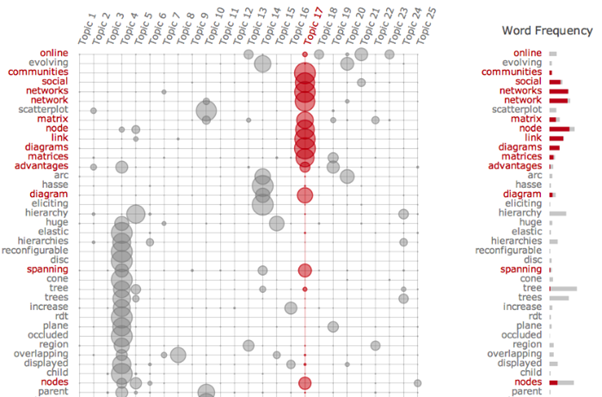

This visualization below is the alternative using LDAviz.


Visualization below may not be visible in Chrome as chrome does not allow running of [local files](https://stackoverflow.com/questions/39007243/cannot-open-local-file-chrome-not-allowed-to-load-local-resource).

We want to save the topics derived for further analysis using the code below. This will allow engagement data derived from the articles to be visualized in an aggregated fashion as topics, instead of per article (which is not ideal as there are 96k articles).   

```{r}`r ''`
group_by(day)%>%
add_column(topic = topic ,.before = 'Date’))
```

## 3.Methods for Presenting Snapshot  
To achieve the objective of presenting a useful snapshot or report card of the media situation, we explored different packages such as [SunburstR(https://cran.r-project.org/web/packages/sunburstR/index.html), [GGVIS](https://cran.r-project.org/web/packages/ggvis/index.html) , [Esquisse](https://cran.r-project.org/web/packages/esquisse/index.html) and [D3PartitionR](https://github.com/AntoineGuillot2/D3partitionR) which can read large volumes of data quickly (using FREAD). 


However, after running some tests, we found the visualizations for SunrburstR and D3Partition to be unsuitable. This is because of the size of the documents found in the corpus being too large to visualize using these methods. The speed of interactions was slow, and the visualization outcomes poor due to the variety of colors used for the range of variables found in the dataset.

```{r, echo=FALSE}
htmltools::tags$iframe(title = "Treemap", src = "Treemap.html", width="1200", height="850")
```

```{r, echo=FALSE}
htmltools::tags$iframe(title = "Circle Treemap", src = "CircleTreemap.html", width="1200", height="850")
```

```{r, echo=FALSE}
htmltools::tags$iframe(title = "Sunburst", src = "Sunburst.html", width="1200", height="850")
```

As such, despite the packages ability to quickly read data (eg. using FREAD) and their ability to present topline data in an interactive and easy to understand manner, it was not suitable for the purposes of our project. 


### 3.1.**Objective 1: Explore** - Sorting through and identifying key events in large corpus of news

The alternative found was using a new package called [CorporaExplorer](https://github.com/kgjerde/corporaexplorer). Using the package creates a Shiny App that allows us to quickly input a corpus of documents that can be easily searched by [date or keyword](https://kgjerde.github.io/corporaexplorer/). The output is an interactive heatmap “where each tile represents one document” as well as each document’s corresponding metadata. Using the data we have loaded, we can easily prepare the corpus for visualization using this package. 


```{r}`r ''`
install.packages(“corporaexplorer”)
library(corporaexplorer)
#preparing the data 
corpus_explorer <- 
  media_explore,
  date_based_corpus = TRUE,
  grouping_variable = "Topic", #this is skipped if date is TRUE
  within_group_identifier = "Source", #this is also skipped if date is TRUE 
  columns_doc_info = c("Topic", "Headline", "URL", "Source", "Total", "Likes", "Shares", "Comments"), #appending the relevant metadata from the dataset
  corpus_name = "Local Media Coverage in 2020", #naming the dashboard
  use_matrix = TRUE, 
  matrix_without_punctuation = TRUE,
  tile_length_range = c(1, 25),
  columns_for_ui_checkboxes = TRUE,
```

With the data prepared, we can now run the Shiny App to explore the corpus

```{r}''`
explore( 
  corpus_explorer,
  search_options = list(optional_info = TRUE), #option for keywords in search
  ui_options = list(font_size = "10px"), #size of font in app
  plot_options = list(max_docs_in_wall_view = 100000) #maximum number of documents in the list 
)
```


The Coporaexplorer package is able to handle the 91k articles quickly and allows for readers to search the entire corpus by (up to 5) keywords. Selecting a specific day in the Coporaexplorer plot allows readers to then discover more about the selected article / document. This includes the corresponding engagement data regarding the article’s reach and URL and allows readers to meet the goal of quickly sorting through a large corpus of news events by time, topic and keyword. 

More detail regarding the module for Objective 1 can be found at the project blog here.

### 3.2.**Objective 2: Discover** - Providing greater detail and context about a topic / news source

#### 3.2.1 USing Sentiment

The second objective to use statistical methods to provide greater detail and context around each topic and news source can be done through sentiment analysis. This will allow readers to understand the value of the sentiment attached to the topic or media source and observe its changes across time. 

There are several sentiment analysis packages available including syuzhet and [sentimentr](https://cran.r-project.org/web/packages/sentimentr/readme/README.html). Lexicons that are available for sentiment analysis include “Bing”, “AFINN” and [“NRC”])(https://hoyeolkim.wordpress.com/2018/02/25/the-limits-of-the-bing-afinn-and-nrc-lexicons-with-the-tidytext-package-in-r/). 

```{r}''`
install.packages(“sentimentr”, “GGally”, “glue”, “reshape2”)
library(“sentimentr”, “GGally”, “glue”, “reshape2”)
#unnest tokens for analysis 
media_words <- unnest_tokens(media_explorer, word, text) 
view(media_words) 
#use bing lexicon to get media sentiment 
media_sentiment_new <- media_words %>%
  inner_join(get_sentiments("bing")) %>%
  count(source, date, sentiment) %>%
  spread(sentiment, n, fill = 0) %>%
  mutate(sentiment = positive - negative)
#use ggplot to plot sentiment over time 
ggplot(media_sentiment_new, aes(date, sentiment, fill = source)) +
  geom_col(show.legend = FALSE)
```
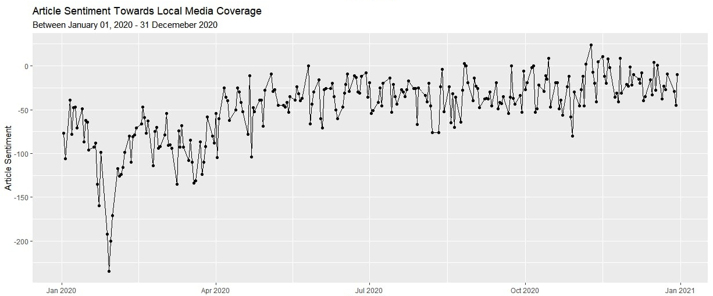


Article sentiment was most in late January, presumably about the same time the first cases of COVID-19 were found in Singapore – but later trended upwards towards the end of the year. From this analysis, readers can infer that the overall sentiment and pandemic situation improved over the span of the year. 

You can change the sentiment plot to show specific media by using ggplot’s facet wrap feature using the code below: 

```{r}''`
#use ggplot to plot sentiment over time 
ggplot(media_sentiment_new, aes(date, sentiment, fill = source)) +
  geom_col(show.legend = FALSE) +
  facet_wrap(~source, ncol = 2, scales = "free_x") #use facet to show media sentiment across different sources 
```

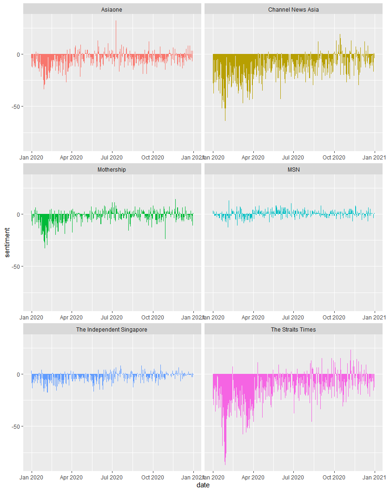

Based on the chart, we can see that the Straits Times and Channel News Asia publishes more articles with negative keywords from the ‘Bing’ lexicon. This could also give insight to the type of news in their respective news coverage (e.g. news about accidents, crime, death tend to feature more negative keywords) as full fledged news sites could cover a wider range of news stories compared to lifestyle news focused new sites such as Must Share News. To better understand this hypothesis, we can use the word cloud functions and word structure (network and n-gram) analysis found in the later section of this blog.

We are also able to use word cloud to visualize positive and negative words used most frequently in media coverage. 

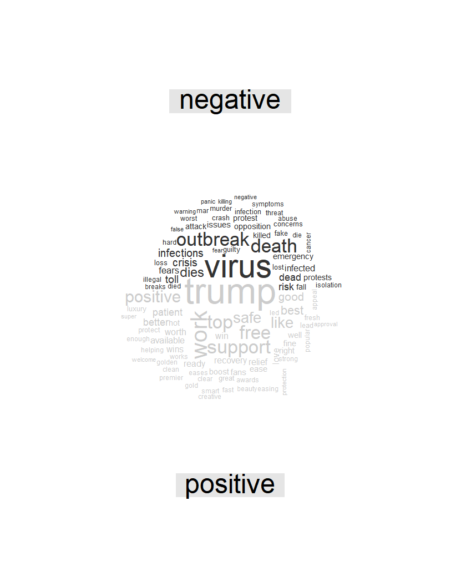

As mentioned earlier, the word cloud visualization here is not particularly useful as it provides very little value as to what the words’ context are. In the visualization above, it does a bit more to separate negative and positive words but this can be a bit arbitrary. For instance, “Trump” here is seen as positive when it refers to the verb “trump” rather than the former President Donald Trump. 

Finally, we are able to also chart news headline sentiment to the SGX to identify if there are any correlations between news sentiment and SGX stock prices. To do this, we will first need SGX data which can be downloaded from [Yahoo Finance](https://sg.finance.yahoo.com/quote/S68.SI?p=S68.SI&.tsrc=fin-srch). 

```{r}''` 
install.packages("gridExtra", "plotly", "dygraphs", "xts", "zoo")
library ("gridExtra", "plotly", "dygraphs", "xts", "zoo")

#read downloaded SGX data
Teststock3 <- read_csv("Data/sgx.csv")
#format date
Date=teststock3$Date <- as.Date(as.character(teststock3$Date,"%Y-%m-%d"))
#check date format 
class(Date)
#join sentiment and SGX datasets by date 
teststock3 <- teststock3 %>%
  left_join(media_sentiment_new, by = c("Date" = "date"))     
view(teststock3)
#convert data to xts format for dygraph
Date=teststock3$Date <- as.xts(ts(start = c(2020-1-1), endc(2020teststock3$Date)
Open=teststock3$Open <- as.numeric(na.locf(teststock3$Open))
Close=teststock3$Close <- as.numeric(na.locf(teststock3$Close))
High=teststock3$High <- as.numeric(na.locf(teststock3$High))
Low=teststock3$Low <- as.numeric(na.locf(teststock3$Low))
Sentiment=teststock3$sentiment <- as.numeric(na.locf(teststock3$sentiment))
#bind coloums and convert to xts format required by Dygraph
z=cbind(Open,Close,High, Low, Sentiment)
newdata=xts(z,Date)
#plot graph using dygraph
dygraph(newdata, main = "SGX VS Sentiment of Local News Headlines") %>%
  dyEvent("2020-01-23", "First COVID-19 Case in SG", labelLoc="bottom")%>% #plotting events
  dyEvent("2020-01-29", "First Travel Restrictions to SG", labelLoc="bottom")%>%
  dyEvent("2020-03-27", "Circuit Breaker Phase 1 starts", labelLoc="bottom")%>%
  dyEvent("2020-05-19", "Circuit Breaker Phase 1 Ends", labelLoc="bottom")%>%
  dyEvent("2020-07-10", "Polling Day", labelLoc="bottom")%>%
  dyEvent("2020-08-09", "National Day", labelLoc="bottom")%>%
  dyEvent("2020-11-09", "Biden confirmed as Winner", labelLoc="bottom")%>%
  dyShading(from = "2020-03-27", to = "2020-5-19", color = "#FFE6E6") %>%
  dyHighlight(highlightCircleSize = 5, 
              highlightSeriesBackgroundAlpha = 0.2,
              hideOnMouseOut = FALSE) %>%
dyRangeSelector()
```

```{r, echo=FALSE}
htmltools::tags$iframe(title = "SGX VS Sentiment", src = "SGX5.html", width="1200", height="850")
```


The resulting plot from Dygraph provides useful interactive features that allows readers to pan and select the time period for analysis. They are also able to mouseover key data points to derive the corresponding SGX prices. 
To understand the tangible impact news events and sentiment has on the stock market, we conducted a multiple linear regression to observe the results. The codechunk for this can be found below: 

```{r}''` 
#create columns for testing MLR
allCols <- colnames(teststock3)
regCols <- allCols[!allCols %in% c("Open","High","Low", "Adj Close")]
regCols <- allCols[!allCols %in% c("Open", "High", "Low")]
#create regression formula 
regCols <- paste(regCols, collapse = "+")
regCols <- paste("Close~",regCols, collapse = "+")
regCols <- as.formula(regCols)
#call MLR 
Teststock3.lm <- lm(regCols, data = teststock3) 
Summary(teststock3.lm)
```


The results for the multiple regression model demonstrate that there is significant collinearity between negative media sentiment and the closing stock prices of the SGX daily. As seen in the results, news events and headlines should be analyzed in greater detail because they can have very real and tangible impact. 


#### 3.2.2 USing WordNetworks

Another method explored for allowing users to read in greater detail, the different topics and news sources, is the analysis and visualization of word structure. This can be done by analyzing the word graph or word networks relating to the topic or media source. Word analysis using statistical methods can be very use in helping to track and visualize the evolution of [news](https://journals.plos.org/plosone/article?id=10.1371/journal.pone.0122174), and demonstrate how differently each media has covered a [topic](https://towardsdatascience.com/measuring-discourse-bias-using-text-network-analysis-9f251be5f6f3).


Using R packages such as tidytext, dplyr, igraph and ggraph, we can [plot](https://www.tidytextmining.com/ngrams.html) the word networks related to different topics in the corpus. 

```{r}''` 
install.packages(“tidytext”, “dplyr”, “igraph”, “ggraph”)
library(“tidytext”, “dplyr”, “igraph”, “ggraph”)
#creating bigrams
media_bigrams <- media_explore %>%
  unnest_tokens(bigram, text, token = "ngrams", n=2)
media_bigrams
#sorting bigrams 
media_bigrams %>%
count(bigram, sort = TRUE)
#splitting bigrams and removing stop words 
bigrams_separated <- media_bigrams %>%
  separate(bigram, c("word1", "word2"), sep = " ")
bigrams_filtered <- bigrams_separated %>%
  filter(!word1 %in% stop_words$word) %>%
filter(!word2 %in% stop_words$word)

#new bigram counts 
# new bigram counts:
bigram_counts <- bigrams_filtered %>% 
  count(word1, word2, sort = TRUE)
bigram_counts
#graphing word network  
bigram_counts
bigram_graph <- bigram_counts %>%
  filter(n > 5) %>%
  graph_from_data_frame()
bigram_graph
set.seed(2017)
ggraph(bigram_graph, layout = "fr") +
  geom_edge_link() +
  geom_node_point() +
geom_node_text(aes(label = name), vjust = 1, hjust = 1)
```


Using the word network plotted above allows readers to identify the words that were frequently used together and gives readers more context to the topic (ie. GE2020). However, this method is not the most intuitive and its presentation left a lot to be desired. 

Referenced earlier in the blog, is Masood’s work that we felt was very useful in visualizing co-occurring words across different media sources. Visualizing this could be very useful as readers can quickly infer if certain keywords or entities have been left out when analyzing topics.  


Unfortunately, this visualization of presenting sets is more useful when the number of documents in the text is small. Visualizing this over 96k articles will be less helpful, even after aggregation into different topics. An alternative approach of visualizing co-occurrence is explore in the next section. 


#### 3.2.2 USing Word Co-occurences

Finally, using the tri-grams identified in the text, we are able to visualize how any two words in a selected corpus is used, where they are similar and where they [diverge](https://www.chrisharrison.net/index.php/Visualizations/WebTrigrams). Research into empirical [linguistics](https://www.researchgate.net/publication/285764383_Collocations_and_statistical_analysis_of_n-grams_Multiword_expressions_in_newspaper_text) have identified how the frequency of words occurring together can give insight and meaning to the treatment of a topic and the ‘closeness’ of association between entities. This can help readers understand the context to how words in media coverage was used when compared to [each other](https://www.hvitfeldt.me/blog/visualizing-trigrams-with-the-tidyverse/). 

For this segment, we were inspired by the work of [Chris Harissson](https://www.chrisharrison.net/index.php/Visualizations/WebTrigrams) and [Emil Hvitfeldt](https://github.com/EmilHvitfeldt). We will need to call on the packages of purrrlyr for this next visualization. The code below is attributed to [Emil Hvitfeldt](https://www.hvitfeldt.me/blog/visualizing-trigrams-with-the-tidyverse/). 

```{r}''` 
install.pacakges(“purrrlyr”)
library(purrrlyr)
n_word <- 20
n_top <- 150
n_gramming <- 3
#creating trigrams
trigrams <- tibble(text = media_explore$Text) %>%
  unnest_tokens(trigram, text, token = "ngrams", n = n_gramming)
#select the start words you want to compare
start_words <- c("covid", "coronavirus")
```
As seen in the visualization above, the word network can be elegantly displayed and compared with each other to see how they unfold more often in media coverage. From the visualization, we can infer that the word PAP is more often related to a wider range of words in media coverage compared to WP. We hope to integrate this function as a module in the Shiny Dashboard for the project.

The proposed sketch and detail regarding the module for Objective 2 can be found in the later section of this blog here. 


### 3.4.**Objective 3: Detect** - Providing alerts to unusual patterns in news analysis 

To meet objective 3 for the project, we researched how technology companies such [CrowdTangle](https://www.theverge.com/2016/11/11/13594338/facebook-acquires-crowdtangle) and [Newswhip](https://www.newswhip.com/2016/08/spike-predict-viral-stories-update/) used engagement figures in order to predict the likelihood articles go viral.  Newswhip utilizes a method of measuring [velocity](https://www.newswhip.com/2014/01/what-is-social-velocity/) by tracking the speed of engagements and measures if it is overperforming when compared to the average interaction speed of other articles from the same publisher.  
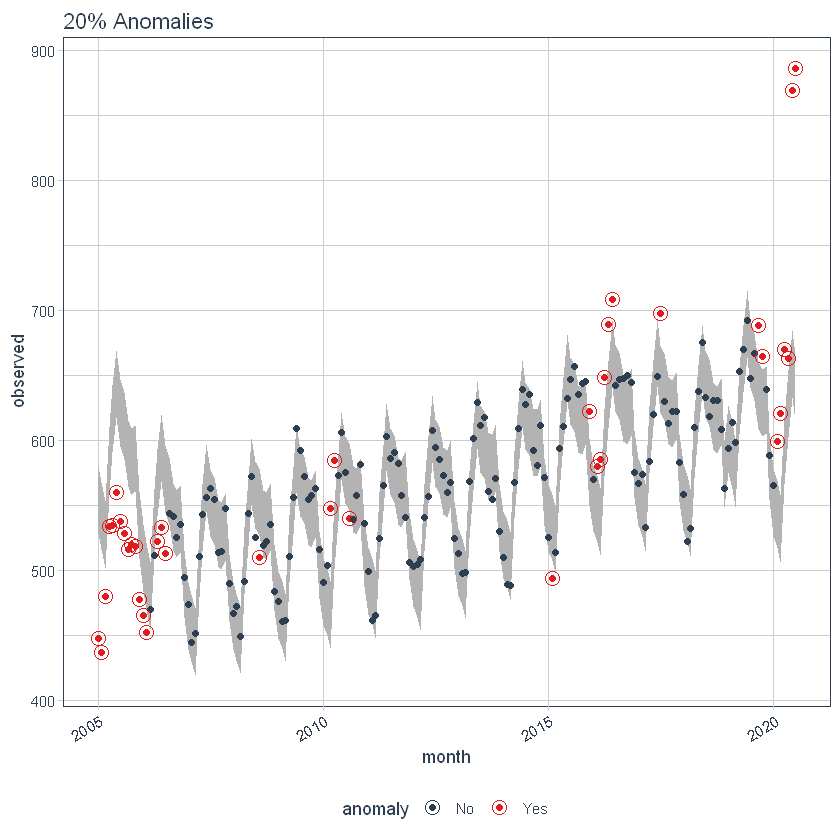

This can be useful for us to visualize anomalies in time series using packages in [R](https://www.analyticsvidhya.com/blog/2020/12/a-case-study-to-detect-anomalies-in-time-series-using-anomalize-package-in-r/). Sorting this by media type or by topic, can help to identify if there are key articles or events that need to be explored first, amongst the influx of articles that being disseminated at any point of time. 

More detail regarding the module for Objective 3 can be found at the project blog here (url)


# Summary of observations from exploration of R Packages 

To summarize, we will be adopting packages for three different modules to meet our objectives of helping readers to better understand news events in a large corpus of headlines, create snapshots that are based on rigorous statistical methods to understand quickly the context surrounding a topic and finally to see red-flags / or anomalous instances in the news corpus. 


# Proposed Sketch of Project Module 2: Discovering Topics and it's context
Based on the research work, methods and proto-typing found above  the proposed dashboard for the Project’s Module that will help readers contextualize news topics and sources can be found in the sketch below. 

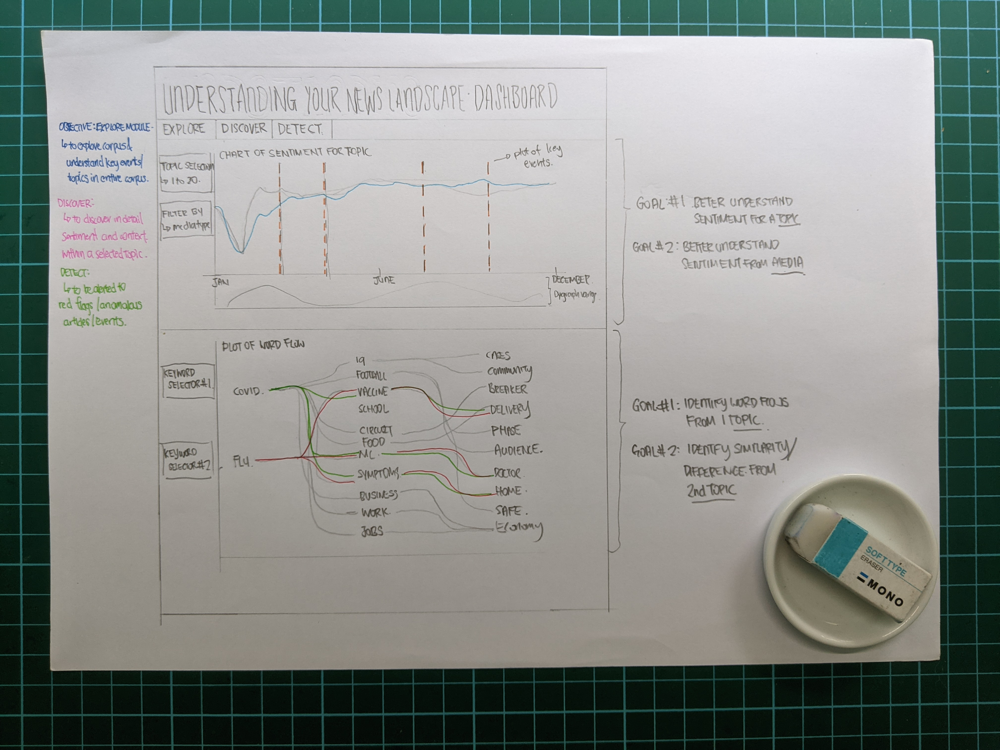

The intended module seeks to provide media sentiment using the ‘bing’ lexicon and give insight into  topics by allowing them to observe the tri-grams most frequently used with the topic keyword. Users will also be able to select the topic or media source in order to create a ‘snapshot’ that would present them with the relevant information. 

Click on the respective links to find out more about modules 1 and 3. The integrated Shiny dashboard for the modules will be presented at a later date. 

# Closing Reflections 

While there are many aspects to explore to help make sense of the news corpus, we have selected   packages and methods that would best suit a large volume of unstructured data and contain interactive user functions to allow them to quickly navigate the corpus and create snapshots around topics they are interested in.

Future work could include advance methods for dynamic topic modeling, which would be helpful in identifying how a topic evolve across time (e.g. from Wuhan Virus, to Coronavirus to Covid-19) as well as building on word-graphing and word network techniques for the identification of duplicate articles or ‘fake news’. Improvements can also be made to the user experience by customizing CRAN packages that are used for the purposes of this project.

Thank you for reading up to this point. 

_This blog is a data visualization assignment for the MITB programme at the Singapore Management University._


